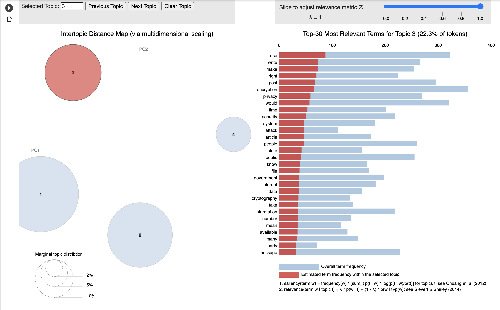
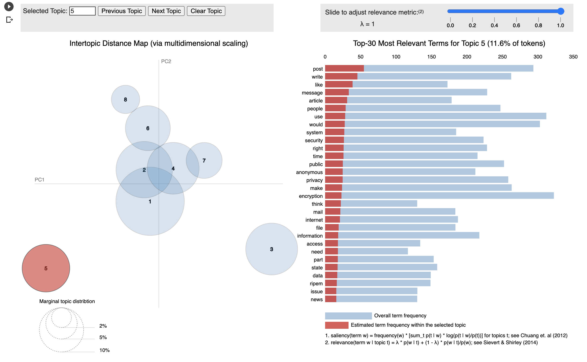

# TEXT CLASSIFICATION USING LDA 
 

Link to presentation can be found [Here](https://docs.google.com/presentation/d/1zoXkzSoB_72SuoHGv7QcCK-8uLo-C-7FfopmASO-scE/edit#slide=id.gdb97ff702f_0_14)

## Table of Contents
 
- [Overview](##ProjectOverview)
- [Team](##Team)
- [Dataset](##Dataset)
- [Database](##Database)
- [Technologies](##TechnologiesUsed)
- [Method](##Method)
    - [Data Restructuring](###DataRestructuring)
    - [Data Preprocessing](###DataPreprocessing)
    - [Machine Learning](###MachineLearning)
- [Analysis](##Analysis)
- [Dashboard](##Dashboard)

## PROJECT OVERVIEW 

### Why we chose this topic? 
Text classification has wide variety of applications in various domains. It can be used in cyber security for classification of documents on the basis of privacy and confidentiality. It can be used for sentiment analysis for customer reviews in on line shopping etc. 

### Overview 
<little bit about topic modelling>

### Questions We Hope To Answer
Whether machine learning provides a sufficient accuracy level for predicting topic classification on unseen text. 

### Purpose 
Perform text classification on email data and categorize data into four categories; crime, politics, entertainment and science. This problem falls under "Topic Modelling".

## TEAM
 
- Fatima Hussain- Model development and technology selection
- Neha Bhole - Data Cleaning
- Beverly Edwards-Smith - Dashboard 
- Veronika Rimsha - Database
- Sibtain Janmohammed - GitHub

### Communication protocol:
- Communication over slack group channel
- Zoom Meetings 4 times per week 
  

## DATASET
 
The following dataset was used in this project. It is a mock journalist emails dataset available on Kaggle. It contains four folders corresponding to four topics - Crime, Politics, Science and Entertainment. Each folder contains 1000+ text files with individual emails.  

[comment]: # ( [NIPS Papers Dataset]https://github.com/kapadias/mediumpo )

* [Emails Dataset](https://www.kaggle.com/dipankarsrirag/topic-modelling-on-emails)

[comment]: # (We intend to use one or both of these datasets. )

## DATABASE 
 
The dataset used in this project is unstructured, therefore Amazon S3 was used as its more appropriate than a conventional SQL database. (NEW -> However, since dataset was difficult to import for analysis in google colab, it was restructured and then uploaded to Amazon S3.)

### Data Restructuring

The 9000+ text files in the dataset were difficult to import from Amazon S3 and iterate over in the Google Colab notebook. Hence, the data was restructed into a dataframe using pandas library. A csv file was saved and uploaded to Amazon S3 for further analysis. 

## TECHNOLOGIES USED
 
### Analysis
Softwares:
- Python
- Google Colab Notebooks
- Jupyter Notebooks
- 

Libraries: 
- Miscellaneous - Pandas, Spark, 
- NLP - NLTK, Gensim
- Machine Learning - 
- Visualization - WordCloud, pyLDAvis
### Dashboard

### Technology Used
- HTML webpage using Flask
- CSS stylepage
- Bootstrap 4
- JS (ES11)

## DASHBOARD & STORYBOARD
 
The dashboard for this project can be accessed here: [Text Classification Dashboard](<link goes here>)
### Interactive Elements

- Input box - to take input from user 
- Buttons - to predict and clear the input box
- Hyperlinks - for details and visuals for each of the models

The storyboard can be found here: [Text Classification Slides](https://docs.google.com/presentation/d/1zoXkzSoB_72SuoHGv7QcCK-8uLo-C-7FfopmASO-scE/edit#slide=id.gdc4b041922_0_2706)

## MACHINE LEARNING MODELS

### Abstract
We intend to perform text classification and use Latent Dirichlet Allocation algorithm.
It is an exploratory process and LDA identifies the hidden topic structures in text documents.  It uses Bayesian statistics and Dirichlet distributions for processing and identifying the topics.

We may consider using the following classification algorithm, along with LDA:
* KNN
* Logistic Regression

### LDA

We performed data cleaning before applying LDA model, and performed following steps:
#### Data Preprocessing

Prior to text classification,  LDA pre-process the raw text/document.

* Normalization: Transform text to normal/canonical form
* Stemming: Reduce a word to its word stem/root without suffixes and prefixes 
* Stopwordremoval: Remove words that do not add any logical meaning 
* Lemmatization:  Words in third person are changed to first person and verbs in past and future tenses are changed into present.
* Tokenization: Break text into ‘tokens’, i.e. words and phrases. Split the text into sentences and the sentences into words. Lowercase the words and remove punctuation.

#### Preprocessing Details
*  Raw data was available in txt files and we created  data frame for all the data and stored in the google COLAB.
*  Stop words are removed and data is lemanized and tokanized. imported "stopwords" from nltk.corpus ,  "WordPunctTokenizer" from nltk.tokanize, "punctuation" from string, and WordNetLemmatizer from nltk.stem 
* Cleaned data is stored in the same dataframe with column name "Filtered Text"

### Bag of Words
Before applying the LDA model, we developed the "Bag of Words" from the "Filtered Text" column:

* Entire sentence is split on spaces and words are separated.
* Dictionary of words is created by  importing  "gensim" and "simple_preprocess" from gensim.utils
* Each word will be shown by no. of times, it appears in the dictionary

### LDA Model Details: 
* We used: lda_model = gensim.models.LdaMulticore(corpus=corpus, id2word=id2word,num_topics=num_topics) to build the model and tried with different number of topics. 
* We see distinct clusters when we choose "No. Topics=4".  If "No. Topics" are increases, intersecting clusters are formed, clearly showing that data set has distinct four categories of text.
* We used pyLDAvis.gensim to see the visuals.

**LDA with four distinct topics versus LDA with two overlapping clusters**

## ANALYSIS 

### SUMMARY 
(What more can you do with this model)
  

