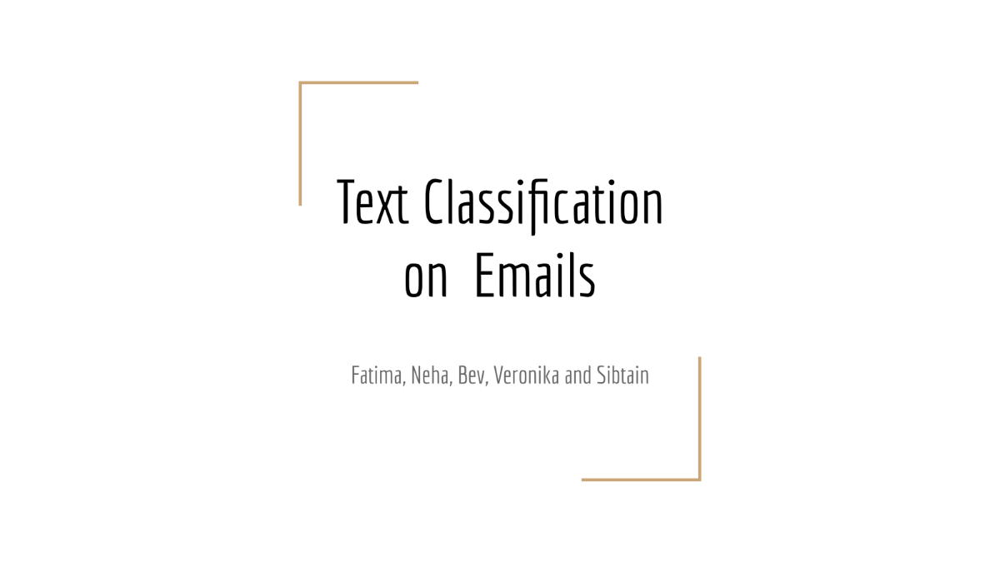
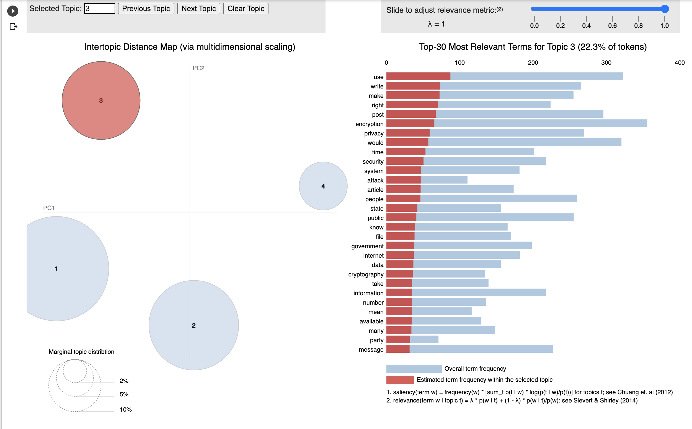
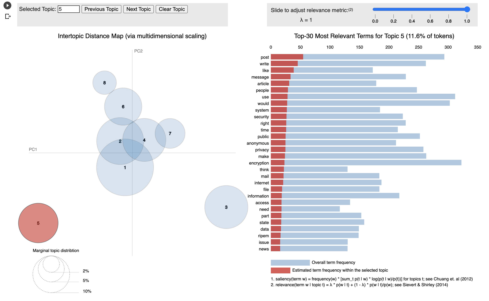
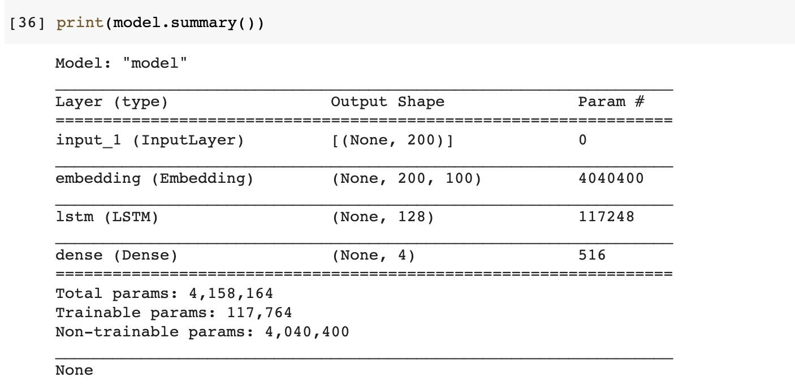
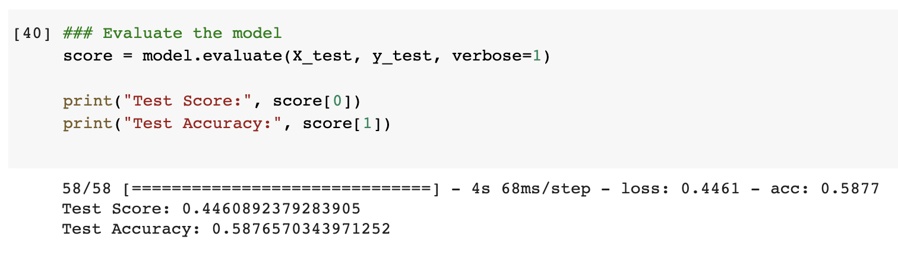
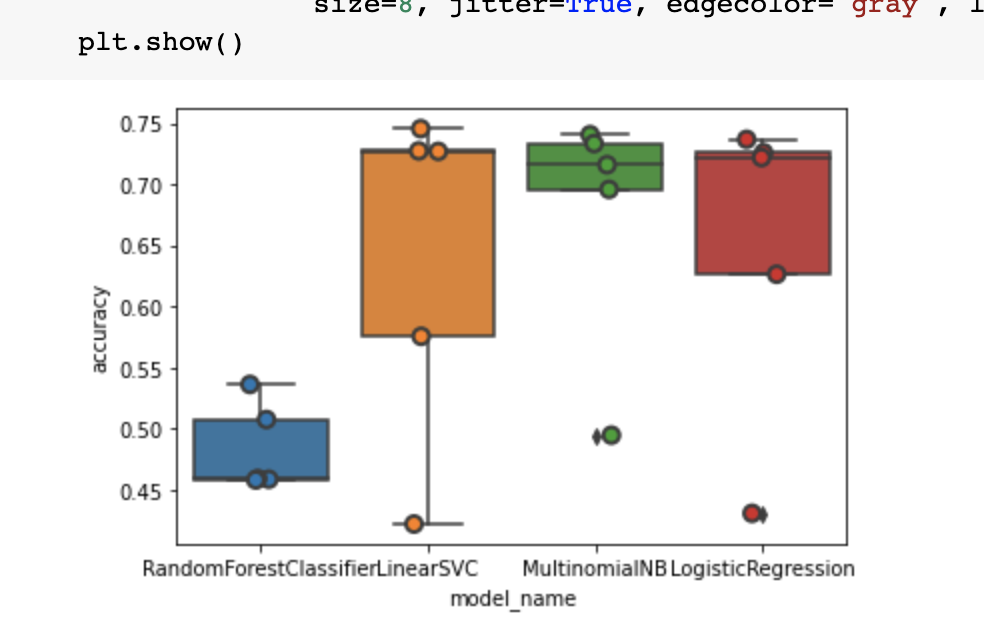
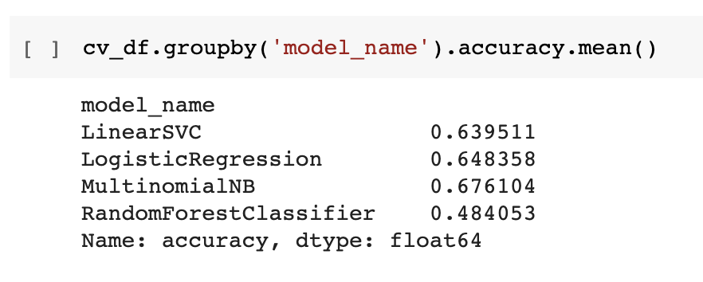

# TEXT CLASSIFICATION USING LDA 
 

## Table of Contents
 
- [Overview](##ProjectOverview)
- [Team](##Team)
- [Dataset](##Dataset)
- [Database](##Database)
- [Technologies](##TechnologiesUsed)
- [Dashboard & Storyboard](##Dashboard&Storyboard)
- [Machine Learning](##MachineLearning)
    - [Data Preprocessing](###DataPreprocessing)
    - [LDA Model](###LDAModel)
    - [Multi-Class Neural Networks](###Multi-ClassNeuralNetworks)
    - [Multi-Class Supervised Models](###Multi-ClassSupervisedModels)
- [Conclusion](##Conclusion)

## PROJECT OVERVIEW 

### Why we chose this topic? 
Text classification has wide variety of applications in various domains. It can be used in cyber security for classification of documents on the basis of privacy and confidentiality. It can be used for sentiment analysis for customer reviews in on line shopping etc. 

### Questions We Hope To Answer
Whether machine learning provides a sufficient accuracy level for predicting topic classification on unseen text. 

### Purpose 
Perform text classification on email data and categorize data into four categories; crime, politics, entertainment and science. This problem falls under "Topic Modelling".

## TEAM
 
- Fatima Hussain- Model choice and Development
- Neha Bhole - Data Cleaning
- Beverly Edwards-Smith - Dashboard 
- Veronika Rimsha - Database
- Sibtain Janmohammed - Github

## DATASET
 
The following dataset was used in this project. It is a mock journalist emails dataset available on Kaggle. It contains four folders corresponding to four topics - Crime, Politics, Science and Entertainment. Each folder contains 1000+ text files with individual emails. 

* [Emails Dataset](https://www.kaggle.com/dipankarsrirag/topic-modelling-on-emails)

## DATABASE 
 
The dataset used in this project is unstructured, therefore Amazon S3 was used as its more appropriate than a conventional SQL database. (NEW -> However, since dataset was difficult to import for analysis in google colab, it was restructured and then uploaded to Amazon S3.)

### Data Restructuring

The 9000+ text files in the dataset were difficult to import from Amazon S3 and iterate over in the Google Colab notebook. Hence, the data was restructed into a dataframe using pandas library. A csv file was saved and uploaded to Amazon S3 for further analysis. The code for data restructuring can be found here: [Data Restructuring](Data Restructuring/Data_Restructuring_Code.ipynb) 

## TECHNOLOGIES USED
 
### Analysis
Softwares:
- Python
- Google Colab Notebooks
- Jupyter Notebooks

Libraries: 
- Miscellaneous - Pandas, Spark, Joblib. 
- NLP - NLTK, Gensim, Regex
- Machine Learning -  sklearn (LogisticRegression, RandomForestClassifier, LinearSVC, MultinomialNB)
- Visualization - WordCloud, pyLDAvis, seaborn

### Dashboard

- HTML webpage using Flask
- CSS stylepage
- Bootstrap 4
- JS (ES11)

## DASHBOARD & STORYBOARD

The storyboard can be found here: [Text Classification Slides](https://docs.google.com/presentation/d/1zoXkzSoB_72SuoHGv7QcCK-8uLo-C-7FfopmASO-scE/edit#slide=id.gdc4b041922_0_2706)

The dashboard for this project can be accessed here: [Text Classification Dashboard](https://project-textclassification.herokuapp.com/)

### Interactive Elements

- Input box - to take input from user 
- Buttons - to predict and clear the input box
- Hyperlinks - for details and visuals for each of the models

## MACHINE LEARNING MODELS

### Abstract
We intend to perform text classification and use Latent Dirichlet Allocation algorithm.
It is an exploratory process and LDA identifies the hidden topic structures in text documents. It uses Bayesian statistics and Dirichlet distributions for processing and identifying the topics. In order to strengthen our LDA model results, we intend to use neural networks. To further testify the text classification obtained from LDA model , we tried Multi-Class Neural Networks and also four Multi-Class Supervised Models.

### LDA
We performed data cleaning before applying LDA model, and performed following steps:

#### Data Preprocessing

Prior to text classification,  LDA pre-process the raw text/document.

* Normalization: Transform text to normal/canonical form
* Stemming: Reduce a word to its word stem/root without suffixes and prefixes 
* Stopwordremoval: Remove words that do not add any logical meaning 
* Lemmatization:  Words in third person are changed to first person and verbs in past and future tenses are changed into present.
* Tokenization: Break text into ‘tokens’, i.e. words and phrases. Split the text into sentences and the sentences into words. Lowercase the words and remove punctuation.

##### Preprocessing Details
*  Raw data was available in txt files and we created  data frame for all the data and stored in the google COLAB.
*  Stop words are removed and data is lemanized and tokanized. imported "stopwords" from nltk.corpus ,  "WordPunctTokenizer" from nltk.tokanize, "punctuation" from string, and WordNetLemmatizer from nltk.stem 
* Cleaned data is stored in the same dataframe with column name "Filtered Text"

##### Bag of Words
Before applying the LDA model, we developed the "Bag of Words" from the "Filtered Text" column:

* Entire sentence is split on spaces and words are separated.
* Dictionary of words is created by  importing  "gensim" and "simple_preprocess" from gensim.utils
* Each word will be shown by no. of times, it appears in the dictionary

#### LDA Model Details: 
* We used: lda_model = gensim.models.LdaMulticore(corpus=corpus, id2word=id2word,num_topics=num_topics) to build the model and tried with different number of topics. 
* We see distinct clusters when we choose "No. Topics=4".  If "No. Topics" are increases, intersecting clusters are formed, clearly showing that data set has distinct four categories of text.
* We used pyLDAvis.gensim to see the visuals.

Click here to take a look at LDA Colab notebook: [LDA Text Classification Code](Notebooks/S3_LDA_Text_Classification.ipynb)

**LDA with four distinct topics versus LDA with two overlapping clusters**

### Multi-Class Neural Networks 
We used multi-class neural networks, utilizing Keras for this purpose. NN specfications for three layers are shown below . Our model have one input layer, one embedding layer, one LSTM layer with 128 neurons and one output layer with 4 neurons since we have 4 labels in the output. 

[//]: # (Neha! please add images below for NNs  "model summary")

#### Multi-Class NN: Features and Design
We need to convert text inputs into embedded vectors. We used GloVe word embeddings to convert text inputs to their numeric counterparts. Afterwards, we trained the model. After training, we tested the model with test data.

#### Evaluation
Initially, model accuracy was not good and was only 25%. We changed the Sigmoid to Softmax in the final layer. It improved the accuracy to 58%.  We also used embedding layer to make . Finally, we improved the accuracy of NN model to 58.7 % as ashown in the figure below: 

[//]: # (Neha!, add the NN new figure of improved accuracy "accurate")

To further improve the accuracy, one of the option is to add "Pooling Layers", but we did not test it. 

#### Reference 
* https://stackabuse.com/python-for-nlp-multi-label-text-classification-with-keras

## Multi-Class Supervised Models
We wanted to build a classification model to accurately classify email text into a predefined category. For this purpose, we used four classifiers:
* Multinomial Naive Bayes
* Logistic Regression
* Linear Support Vector Machine
* Random Forest

#### Multi-Class Classifier: Features and Design
To train supervised classifiers, we first transformed the “email text” into a vector of numbers. We explored vector representations such as TF-IDF weighted vectors.
After having this vector representations of the text we can train supervised classifiers to test unseen “text” and predict the category on which they fall.  After all the data transformation, and having all the features and labels, we train the classifiers.

#### Comparison and Evaluation 
We compared the accuracy of 4 classifiers and found Multinomial Naive Bayes to best with accuracy of 67 %, Random Forest with worst accuracy of 48 %. While, Linear SVM and Logistic Regression showed almost the same accuracy of  63% and 64%, respctively. It is shown in the figure below:

Click here to take a look at Naive Bayes Colab notebook: [Naive Bayes Text Classification Code](Notebooks/S3_NaiveBayes_TextClassification.ipynb)

[//]: # (Neha!, please add the figures here for comparison "classifiers", "model summary")

#### Reference
* https://towardsdatascience.com/multi-class-text-classification-with-scikit-learn-12f1e60e0a9f
* https://sci2lab.github.io/ml_tutorial/multiclass_classification/#Random-Forest

## Conclusion
We used three different models for text classification; LDA , NN and set of multiclass supervised models. LDA model give us the probablity of relevance of a given text, to a specfic category. While multiclass supervised algorithms (Multinomial Naive Bayes,  Logistic Regression,  Linear Support Vector Machine and Random Forest) give us the exact category to which the text belongs.  We did not test NN for the test data, as we already had two working models.
