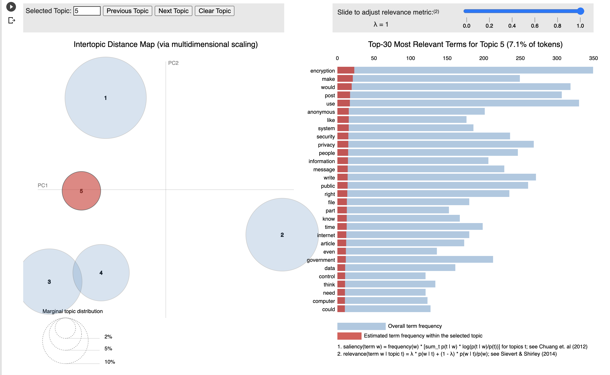

# Text_Classification

## Problem to Solve
Perform text classification on email data and categorize data into four categaries; crime, politics, entertainment and science. This problem falls under "Topic Modelling".

## Rationale for Topic 
Text classification has wide variety of applications in various domains. It can be used in cyber security for classification of doccuments on the basis of privacy and confideniality. It can be used for sentiment analysis for customer reviews in on line shopping etc. 

## Team Members
* Fatima Hussain- Model development and technology selection
* Neha - Data Cleaning
* Bev - Dashboard 
* Veronika - Database
* Sibtain - GitHub

### Communication protocol:
- Slack group
- Zoom 
- Meetings 4 times per week 

## Machine Learning Model 
We intend to perform text classification and use Latent Dirichlet Allocation algorithm.
It is an exploratory process and LDA identifies the hidden topic structures in text documents.  It uses Bayesian statistics and Dirichlet distributions for processing and identifyimg the topics.

We can use the following classification algorithm, alogwith LDA:
* KNN
* Logitic Regression

### Data Preprocessing
Prior to text classification,  LDA  pre-process the raw text/doccument.

* Normalization: Transform text to normal/canonical form
* Stemming: Reduce a word to its word stem/root without suffixes and prefixes 
* Stopwordremoval: Remove words that do not add any logical meaning 
* Lemmatization:  Words in third person are changed to first person and verbs in past and future tenses are changed into present.
* Tokenization: Break text into ‘tokens’, i.e. words and phrases . Split the text into sentences and the sentences into words. Lowercase the words and remove punctuation.

### Datasets 

* [NIPS Papers Dataset](https://github.com/kapadias/mediumposts/blob/master/natural_language_processing/topic_modeling/data/NIPS%20Papers.zip)
* [Emails Dataset](https://www.kaggle.com/dipankarsrirag/topic-modelling-on-emails)

We intend to use one or both of these datasets. 

## Database
Since the dataset used in this project is unstructured therefore Amazon S3 is more appropriate than a conventional SQL database. 

## Dashboard
Technology 
- HTML webpage using Flask
- CSS stylepage
- Bootstrap 4
- JS (ES11) 
- consider the use of Tableau 
Layout
- consideration to be given on how to be included in final presentation....